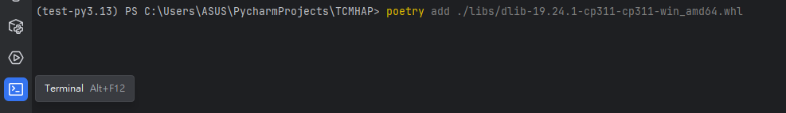

# TCMHAP
畢業專題-中醫健康分析後端(Python程式)

## 檔案命名
所有檔案命名請用小寫，不要用大寫

功能名稱跟資料夾之間用底線_來分隔

功能名稱_資料夾.py 例如: hologram_routes.py

# [GitHub](https://github.com/Yun-Work/TCMHAP "Google's Homepage") 專案流程
下述以個人yun branch進行介紹(先確認已切換到個人branch)
1. 點選左方工具列中Commit工具(快捷鍵Alt+0)     

2. 勾選修改好要上傳的檔案  

3. 輸入修改的內容訊息          

4. 選擇Commit   

5. 右鍵 Local -> yun 點選 push 確認好修改得內容至 Remote>yun    
    

6. 右鍵 Remote -> dev 選擇 checkout，右鍵 Remote -> yun 選擇 merge yun into dev      
     

7. 右鍵 Local -> dev 點選 push    

## push
    儲存程式碼至雲端Github

# 專案啟動方式
## 1. 設定啟動參數

## 2. Run start.py

# Poetry 使用介紹
## 新增套件
    poetry add 套件名稱
## 新增.whl套件
1. 將檔案放置於libs資料夾下   

2. 點選右下角工具列中Terminal終端，輸入新增套件的指令
